# Documento de Diseño de Software (SDD)

## Sistema de Gestión de Reservas y Operaciones para el Restaurante D'Barrio Broaster

| Dato | Información |
|---|---|
| Nombre del producto | Restaurant Management & Reservation System |
| Acrónimo | RMRS |
| Organización | Restaurante D'Barrio Broaster |
| Tipo de solución | Aplicación web transaccional |
| Arquitectura | Modelo–Vista–Controlador |
| Tecnologías principales | PHP, Apache, MySQL/MariaDB, HTML, CSS y JavaScript |
| Acceso a datos | PDO con consultas parametrizadas |
| Entorno académico | XAMPP |
| Documento relacionado | Plan Integral de Desarrollo de Software |

## Propósito del documento

El presente Documento de Diseño de Software, denominado SDD por sus siglas en inglés, consolida las decisiones arquitectónicas, estructurales y técnicas adoptadas para el desarrollo del Sistema de Gestión de Reservas y Operaciones del Restaurante D'Barrio Broaster.

Su propósito es describir y justificar la arquitectura, los módulos funcionales, el modelo de datos, los componentes técnicos, la navegación, las interfaces, la seguridad, la persistencia, el flujo de información, el despliegue y las posibilidades de evolución del producto implementado.

El documento complementa el Plan de Gestión del Proyecto y el Plan de Calidad del Software. Asimismo, permite mantener la trazabilidad entre las necesidades identificadas en el diagnóstico organizacional, los requisitos funcionales del Product Backlog, las decisiones de diseño y los componentes que conforman el sistema final.

## Alcance del diseño

El diseño contempla los siguientes procesos:

- Reserva pública de clientes.
- Registro del adelanto y voucher.
- Validación de reservas desde recepción.
- Confirmación de llegada del cliente.
- Administración del estado de las mesas.
- Gestión de la lista de espera.
- Administración de categorías y productos.
- Registro y actualización de pedidos.
- Control de caja y cobros.
- Administración de usuarios y roles.
- Consulta de indicadores y reportes gerenciales.

## Actores del sistema

| Actor | Responsabilidad principal |
|---|---|
| Cliente | Solicitar una reserva y registrar el voucher correspondiente al adelanto. |
| Recepcionista | Revisar reservas, validar adelantos, confirmar llegadas, administrar mesas y gestionar la lista de espera. |
| Mesero | Registrar y actualizar los pedidos asociados a las mesas. |
| Cajero | Registrar el pago final, aplicar el adelanto validado y cerrar la venta. |
| Administrador | Gestionar usuarios, roles, mesas, productos, categorías y configuraciones operativas. |
| Gerente | Consultar indicadores, ventas y reportes consolidados. |

## 4.1 Arquitectura del sistema

RMRS se implementa mediante el patrón arquitectónico **Modelo–Vista–Controlador (MVC)**, organizado en tres capas lógicas:

1. **Capa de presentación:** compuesta por vistas PHP, HTML, CSS y JavaScript.
2. **Capa de aplicación:** integrada por el router, middleware y controladores.
3. **Capa de datos:** compuesta por modelos, conexión PDO y MySQL/MariaDB.

La arquitectura física corresponde a un despliegue monolítico de una sola instancia. Apache, PHP y MySQL/MariaDB se ejecutan dentro del mismo entorno local XAMPP. Esta configuración responde al alcance académico y a las restricciones de infraestructura definidas para el proyecto, sin impedir una separación futura de sus componentes.

### Figura 4.1. Arquitectura general del sistema

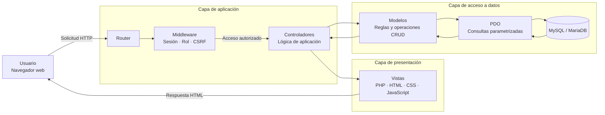

**Fuente:** Elaboración propia.

El flujo comienza cuando el usuario realiza una solicitud desde el navegador. El router identifica la ruta solicitada y deriva la ejecución al controlador correspondiente. Antes de procesar una operación protegida, el middleware verifica la sesión, el rol autorizado y, cuando corresponde, el token CSRF.

El controlador coordina la lógica de aplicación e invoca a los modelos necesarios. Los modelos acceden a MySQL/MariaDB mediante PDO y consultas parametrizadas. Finalmente, el controlador entrega los datos procesados a una vista, la cual genera la respuesta HTML sin incorporar lógica de negocio ni acceso directo a la base de datos.

### Figura 4.2. Secuencia general de una solicitud

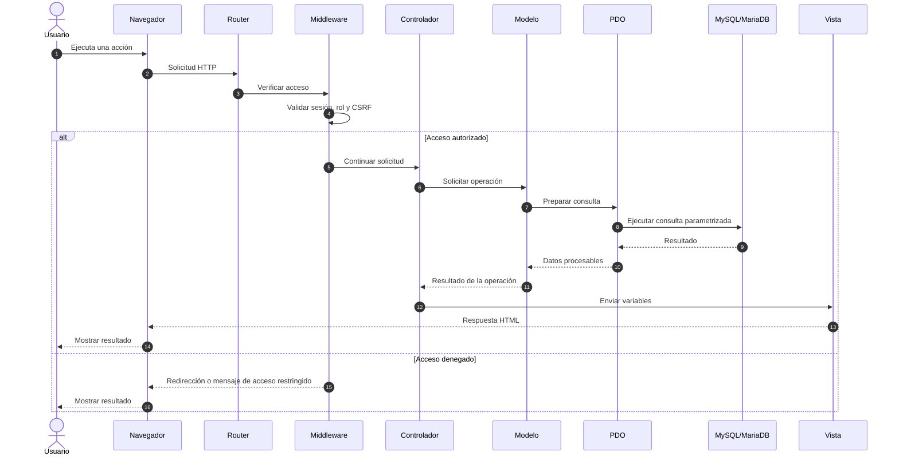

**Fuente:** Elaboración propia.

## 4.2 Diseño arquitectónico: principios aplicados

La arquitectura se sustenta en principios orientados a reducir el acoplamiento, mejorar la mantenibilidad y delimitar las responsabilidades de cada componente.

### Separación de responsabilidades

Las vistas se encargan únicamente de la presentación. Los controladores coordinan las operaciones y los modelos concentran la interacción con los datos. Esta separación evita que la lógica del negocio quede distribuida en archivos de interfaz.

### Responsabilidad única

Cada controlador y modelo atiende un dominio funcional determinado. Por ejemplo, la gestión de reservas se mantiene separada de los pedidos, cobros y reportes.

### Modularidad

Los componentes se organizan según el proceso del negocio al que pertenecen. Esta estructura facilita localizar errores, incorporar mejoras y realizar pruebas específicas sobre cada módulo.

### Acceso centralizado a los datos

La conexión a la base de datos se administra mediante un componente común basado en PDO. De esta manera se evita crear conexiones independientes y se unifica la forma de ejecutar las consultas.

### Seguridad por diseño

Los controles de autenticación, autorización, protección CSRF, validación de entradas y escape de salida se consideran parte de la arquitectura y no funcionalidades añadidas al final del proyecto.

### Trazabilidad

Cada módulo responde a una necesidad del negocio y se relaciona con historias de usuario, criterios de aceptación, componentes técnicos y casos de prueba.

### Bajo acoplamiento

La interacción entre las capas se realiza mediante responsabilidades definidas. Las vistas no consultan directamente los modelos y los modelos no dependen de las interfaces de usuario.

### Alta cohesión

Cada componente agrupa operaciones relacionadas con un mismo propósito. Esto facilita su comprensión y mantenimiento.

## 4.3 Diseño modular

El sistema se divide en módulos funcionales asociados a los procesos principales del restaurante.

### Tabla 4.1. Diseño modular del sistema

| Módulo | Objetivo | Funciones principales | Reglas y validaciones | Acceso |
|---|---|---|---|---|
| Autenticación | Controlar el ingreso al sistema. | Inicio de sesión, validación de credenciales y cierre de sesión. | Credenciales válidas, usuario habilitado y sesión activa. | Usuarios registrados. |
| Usuarios y roles | Administrar cuentas y perfiles. | Crear, actualizar, consultar y controlar usuarios. | Nombre de usuario no duplicado y rol válido. | Administrador. |
| Reservas | Registrar solicitudes públicas. | Registrar cliente, fecha, horario, número de personas, adelanto y voucher. | Datos obligatorios, horario válido, capacidad suficiente y archivo permitido. | Cliente y recepción. |
| Recepción | Validar solicitudes y llegadas. | Revisar reservas, consultar vouchers, aprobar o rechazar adelantos y confirmar llegada. | Solo solicitudes pendientes pueden revisarse. | Recepcionista y administrador. |
| Mesas | Controlar disponibilidad. | Crear, actualizar y consultar mesas y sus estados. | Capacidad válida y transición de estado consistente. | Recepción y administrador. |
| Lista de espera | Organizar clientes sin mesa inmediata. | Registrar, ordenar, consultar y asignar clientes. | Atención según orden de registro y disponibilidad. | Recepción. |
| Categorías | Organizar el catálogo. | Crear y actualizar categorías. | Nombre obligatorio y estado válido. | Administrador. |
| Productos | Mantener productos disponibles. | Registrar nombre, precio, categoría y estado. | Precio válido, categoría existente y estado definido. | Administrador. |
| Pedidos | Registrar consumos por mesa. | Crear pedido, agregar productos, actualizar cantidades y controlar estado. | Mesa válida, productos activos, cantidades positivas y total calculado. | Mesero y administrador. |
| Caja y cobros | Registrar y cerrar pagos. | Consultar pedido, aplicar adelanto, calcular saldo y registrar método de pago. | Saldo igual al total menos adelanto validado. | Cajero y administrador. |
| Dashboard | Mostrar indicadores operativos. | Visualizar reservas, pedidos, mesas, cobros y ventas. | Datos consolidados según periodo consultado. | Gerente y administrador. |
| Reportes | Consultar información histórica. | Aplicar filtros y obtener resultados por fechas y estados. | Rango de fechas válido y acceso autorizado. | Gerente y administrador. |

### Figura 4.3. Relación entre módulos funcionales

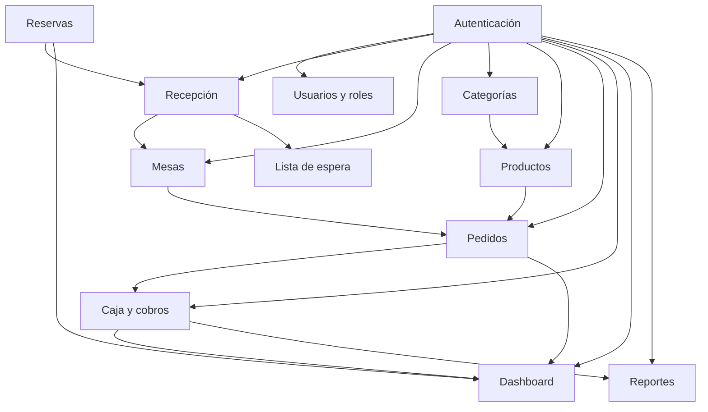

**Fuente:** Elaboración propia.

La relación modular refleja la secuencia de dependencia del negocio. Una reserva puede ser revisada por recepción y asociarse posteriormente con la disponibilidad de una mesa. La mesa permite iniciar un pedido, el pedido utiliza productos del catálogo y su cierre constituye la entrada para el proceso de caja. Finalmente, la información consolidada alimenta el dashboard y los reportes.

## 4.4 Diseño de base de datos

El sistema utiliza un modelo relacional para conservar la integridad y trazabilidad de la información. Las tablas se vinculan mediante claves primarias y foráneas, permitiendo representar el flujo operativo desde el cliente y la reserva hasta el pedido, el cobro y el reporte gerencial.

Las entidades consideradas en el diseño son:

- `clientes`
- `reservas`
- `pagos`
- `mesas`
- `lista_espera`
- `categorias`
- `productos`
- `pedidos`
- `detalle_pedido`
- `caja`
- `cobros`
- `usuarios`
- `empleados`
- `roles`

### Figura 4.4. Modelo relacional conceptual

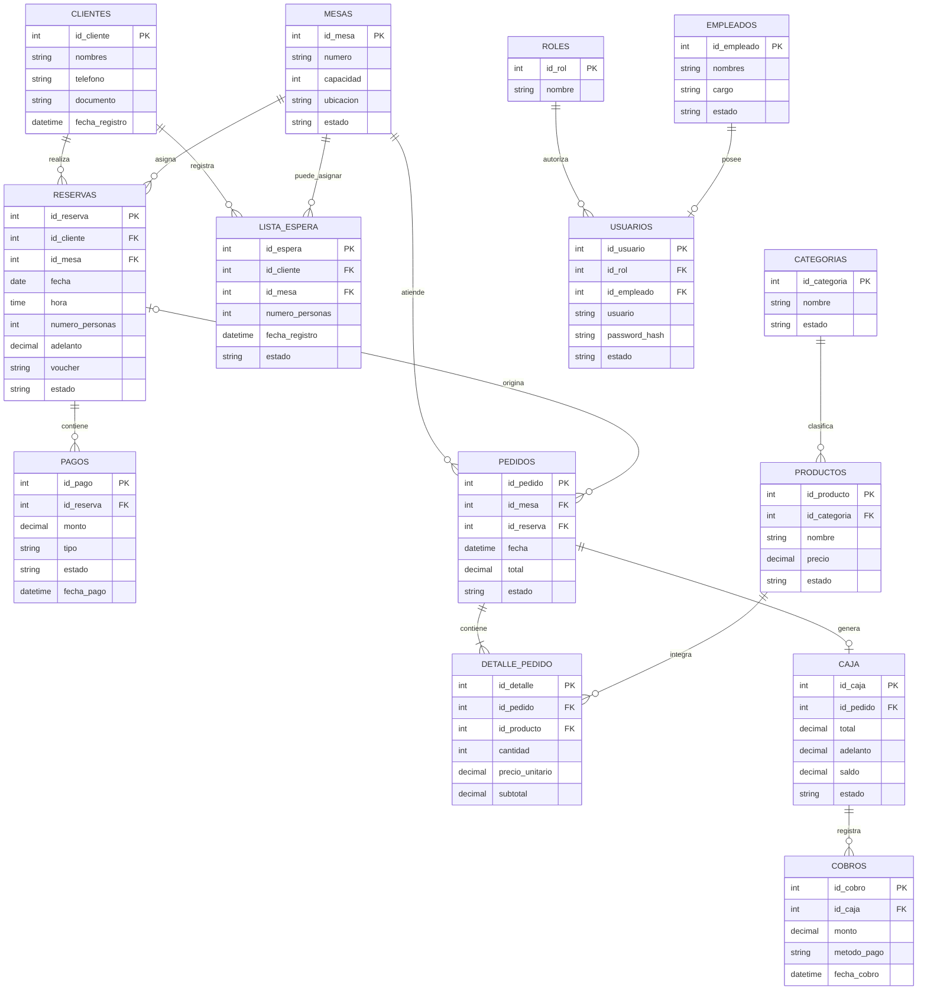

**Fuente:** Elaboración propia.

> Los atributos mostrados representan el modelo conceptual resumido. Los nombres y campos definitivos deben mantener correspondencia con el esquema SQL implementado en el repositorio.

### Reglas de integridad

El diseño de la base de datos considera las siguientes reglas:

- Cada reserva debe estar asociada a un cliente registrado.
- Una reserva solo puede asociarse a una mesa que cumpla la capacidad requerida.
- El voucher y el adelanto deben vincularse con la reserva correspondiente.
- Un pedido debe pertenecer a una mesa válida.
- Cada detalle de pedido debe referenciar un producto existente.
- Los subtotales se calculan a partir de la cantidad y el precio unitario.
- El total del pedido corresponde a la suma de sus detalles.
- El saldo de caja corresponde al total del pedido menos el adelanto validado.
- Cada cobro debe asociarse con un registro de caja.
- Cada usuario debe disponer de un rol válido.
- Las claves foráneas deben impedir registros huérfanos.

## 4.5 Diseño de componentes

Los componentes técnicos implementan las responsabilidades definidas por la arquitectura MVC.

### Tabla 4.2. Componentes técnicos

| Componente | Responsabilidad |
|---|---|
| `Router` | Interpretar la ruta solicitada y dirigir la ejecución al controlador y acción correspondientes. |
| `AuthMiddleware` | Verificar la existencia de una sesión válida y comprobar el rol requerido. |
| `Controllers` | Coordinar la solicitud, validar datos, invocar modelos y seleccionar la vista. |
| `Models` | Ejecutar operaciones de persistencia y aplicar reglas relacionadas con el dominio. |
| `Views` | Presentar la información en HTML sin acceder directamente a la base de datos. |
| `Database` | Proporcionar una conexión PDO centralizada. |
| `Session` | Mantener el estado de autenticación y los datos mínimos del usuario. |
| `Security` | Generar y verificar tokens CSRF, validar entradas y escapar salidas. |
| `Validation` | Comprobar formatos, campos obligatorios, rangos y reglas previas al procesamiento. |
| `Public Assets` | Contener estilos CSS, archivos JavaScript e imágenes utilizadas por las vistas. |

### Figura 4.5. Diagrama de componentes

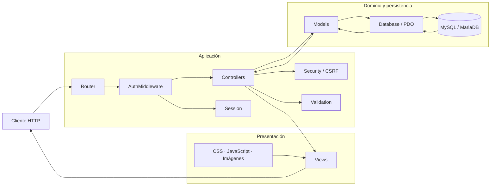

**Fuente:** Elaboración propia.

## 4.6 Diseño de navegación

La navegación se organiza según el rol autenticado y las responsabilidades operativas de cada usuario. El sistema no presenta las mismas opciones a todos los perfiles; cada rol accede únicamente a los módulos necesarios para ejecutar sus funciones.

### Figura 4.6. Mapa general de navegación

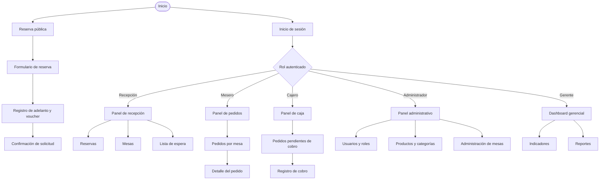

**Fuente:** Elaboración propia.

### Flujo operativo principal

El recorrido funcional principal del sistema es:

```text
Cliente → Reserva → Voucher → Recepción → Mesa → Pedido → Caja → Reporte
```

Cada transición representa un cambio persistido en el estado del proceso. La reserva inicia como solicitud, recepción revisa la información, la mesa refleja su disponibilidad, el pedido registra el consumo y caja consolida el pago final. Posteriormente, los datos se utilizan en los reportes gerenciales.

## 4.7 Diseño de interfaces

Las interfaces se diseñan para usuarios con conocimientos tecnológicos básicos. Por ello, se priorizan la simplicidad, la claridad de las acciones y la retroalimentación inmediata.

### Principios de interfaz

- Menús definidos según el rol del usuario.
- Formularios con etiquetas visibles y campos agrupados.
- Mensajes claros de confirmación, advertencia y error.
- Validaciones cercanas al campo que presenta el problema.
- Estados identificables para reservas, mesas, pedidos y cobros.
- Tablas con acciones contextualizadas.
- Botones con nombres asociados directamente con la operación.
- Reducción de pasos innecesarios en tareas frecuentes.
- Confirmación previa para acciones que alteran información crítica.
- Diseño adaptable a resoluciones de escritorio y dispositivos móviles.

### Estados visuales principales

| Elemento | Estados que deben representarse |
|---|---|
| Reserva | Pendiente, confirmada, rechazada, atendida o cancelada. |
| Mesa | Libre, reservada, ocupada o en limpieza. |
| Lista de espera | Pendiente, asignada, atendida o cancelada. |
| Pedido | Abierto, en atención, cerrado o cobrado. |
| Voucher | Pendiente, validado o rechazado. |
| Caja | Pendiente de cobro o cerrada. |
| Usuario | Activo o inactivo. |
| Producto | Disponible o no disponible. |

### Figura 4.7. Flujo de interacción para una reserva

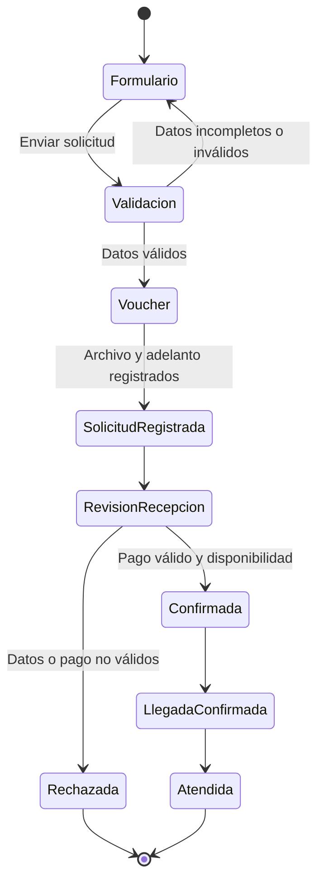

**Fuente:** Elaboración propia.

## 4.8 Diseño de seguridad

La seguridad se diseña considerando que RMRS procesa credenciales, datos personales, vouchers, adelantos, pedidos y cobros. Los controles se aplican en diferentes capas para reducir la posibilidad de acceso no autorizado, manipulación de solicitudes o exposición de información.

### Autenticación

El acceso a los módulos internos requiere credenciales válidas. Las contraseñas no deben almacenarse en texto plano; deben conservarse mediante funciones de hash seguras disponibles en PHP.

### Autorización basada en roles

Cada usuario dispone de un rol asociado. El middleware verifica dicho rol antes de permitir el acceso a una ruta o acción protegida.

### Protección CSRF

Las operaciones que modifican información deben incluir un token CSRF generado en la sesión. El servidor valida el token antes de ejecutar la solicitud.

### Prevención de inyección SQL

Las operaciones de base de datos utilizan PDO y consultas preparadas. Los valores proporcionados por el usuario se transmiten mediante parámetros y no se concatenan directamente en las sentencias SQL.

### Prevención de XSS

Los datos mostrados en las vistas deben escapar caracteres especiales antes de incorporarse al HTML.

### Validación de archivos

Los vouchers cargados deben comprobarse según extensión, tipo, tamaño y nombre seguro. Los archivos no deben ejecutarse como código ni almacenarse junto con archivos sensibles de configuración.

### Control de sesión

La sesión conserva únicamente la información necesaria para autenticar al usuario y determinar su rol. El cierre de sesión debe invalidar los datos asociados.

### Protección del repositorio

El repositorio no debe contener:

- Contraseñas reales.
- Archivos de configuración con credenciales.
- Copias de bases de datos con información personal.
- Vouchers reales.
- Datos de clientes identificables.
- Archivos temporales del entorno local.

### Figura 4.8. Capas de seguridad

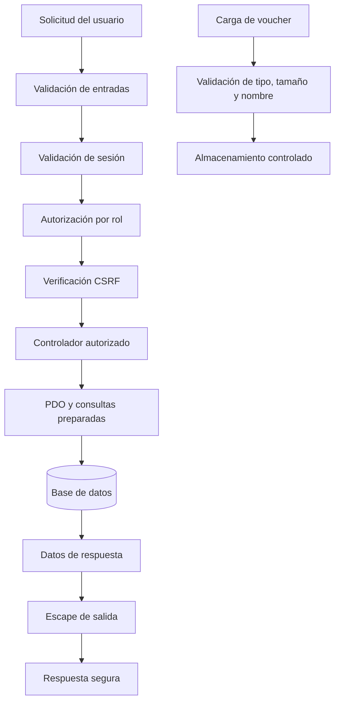

**Fuente:** Elaboración propia.

### Matriz resumida de permisos

| Módulo | Cliente | Recepción | Mesero | Cajero | Administrador | Gerente |
|---|:---:|:---:|:---:|:---:|:---:|:---:|
| Reserva pública | Sí | Consulta | No | No | Consulta | Consulta |
| Validación de voucher | No | Sí | No | Consulta | Sí | Consulta |
| Gestión de mesas | No | Sí | Consulta | Consulta | Sí | Consulta |
| Lista de espera | No | Sí | No | No | Sí | Consulta |
| Productos y categorías | Consulta | Consulta | Consulta | Consulta | Sí | Consulta |
| Pedidos | No | Consulta | Sí | Consulta | Sí | Consulta |
| Caja y cobros | No | Consulta | Consulta | Sí | Sí | Consulta |
| Usuarios y roles | No | No | No | No | Sí | No |
| Dashboard y reportes | No | Limitado | Limitado | Limitado | Sí | Sí |

La tabla representa el criterio de autorización funcional del diseño. Los permisos concretos deben conservar correspondencia con las rutas y controles implementados en el sistema.

## 4.9 Diseño de persistencia

La persistencia se implementa mediante modelos que utilizan una conexión PDO centralizada. Los controladores no ejecutan directamente sentencias SQL, y las vistas no interactúan con los modelos ni con la base de datos.

### Operaciones CRUD

Los modelos concentran las operaciones de:

- Creación de registros.
- Consulta por identificador.
- Consulta mediante filtros.
- Actualización de información.
- Cambio de estado.
- Eliminación lógica cuando corresponda.

### Consultas parametrizadas

Las consultas preparadas separan la estructura SQL de los valores proporcionados por el usuario. Esto reduce el riesgo de inyección SQL y permite mantener una forma uniforme de acceso a datos.

### Transacciones

Las operaciones que afectan varias tablas deben ejecutarse como una unidad lógica. El proceso de cierre de pedido y cobro constituye el caso principal, debido a que requiere conservar consistencia entre pedido, detalle, caja, cobro, reserva y estado de la mesa.

### Figura 4.9. Transacción de cierre y cobro

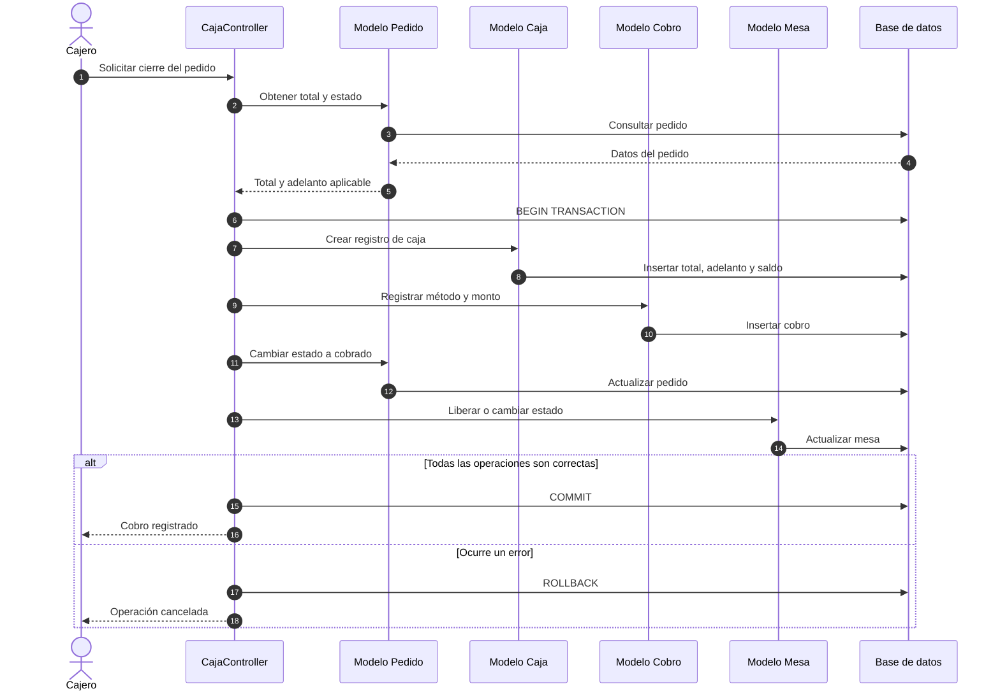

**Fuente:** Elaboración propia.

### Reglas de consistencia

- No registrar un cobro para un pedido inexistente.
- No cobrar dos veces el mismo pedido.
- No aplicar un adelanto que no haya sido validado.
- No permitir un saldo negativo.
- No cerrar la caja si existe una operación incompleta.
- No liberar una mesa antes de completar el cierre correspondiente.
- Revertir todos los cambios si una parte de la transacción falla.

## 4.10 Diseño de calidad

El diseño del sistema incorpora criterios relacionados con el perfil ISO/IEC 25010 definido para el proyecto. Las características prioritarias son adecuación funcional, fiabilidad y seguridad.

| Característica | Aplicación en el diseño |
|---|---|
| Adecuación funcional | Los módulos se relacionan directamente con las necesidades operativas del restaurante. |
| Fiabilidad | Se aplican validaciones de estado, reglas de integridad y transacciones. |
| Seguridad | Se incorporan sesión, roles, CSRF, consultas parametrizadas y escape de salida. |
| Usabilidad | Las interfaces priorizan claridad, consistencia y retroalimentación inmediata. |
| Eficiencia de desempeño | Las consultas deben utilizar filtros y recuperar únicamente la información requerida. |
| Compatibilidad | La aplicación funciona mediante tecnologías web y un servidor Apache. |
| Mantenibilidad | La arquitectura MVC separa responsabilidades y organiza los módulos. |
| Portabilidad | El despliegue puede reproducirse en un entorno compatible con PHP y MySQL/MariaDB. |

### Criterios técnicos de aceptación

- Las rutas protegidas requieren sesión válida.
- Los usuarios no pueden acceder a módulos ajenos a su rol.
- Los formularios validan datos obligatorios y formatos.
- Las operaciones críticas incorporan protección CSRF.
- Las consultas utilizan PDO y parámetros.
- El total del pedido se calcula a partir de sus detalles.
- El adelanto solo se aplica después de ser validado.
- El saldo final debe coincidir con la regla definida.
- Los cambios relacionados se ejecutan con consistencia.
- Las respuestas muestran mensajes comprensibles para el usuario.

## 4.11 Diseño de flujo de datos

El flujo de datos principal integra los procesos de reserva, recepción, mesa, pedido, caja y gerencia.

### Figura 4.10. Flujo operativo de información

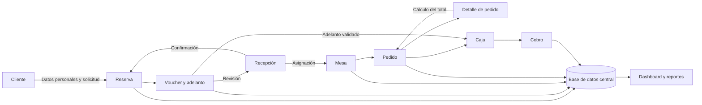

**Fuente:** Elaboración propia.

### Descripción del flujo

1. El cliente registra sus datos y solicita una reserva.
2. La reserva incorpora fecha, horario, número de personas y voucher.
3. Recepción revisa la información y valida o rechaza el adelanto.
4. Una reserva confirmada puede asociarse con una mesa disponible.
5. El mesero registra el pedido correspondiente a la mesa.
6. Los productos y cantidades forman el detalle del pedido.
7. El sistema calcula el total del consumo.
8. Caja recupera el total y descuenta el adelanto validado.
9. El cajero registra el método de pago y finaliza el cobro.
10. La información consolidada queda disponible para indicadores y reportes.

### Figura 4.11. Estados principales del proceso operativo

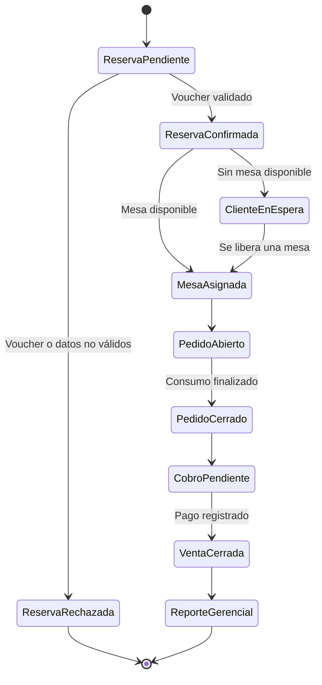

**Fuente:** Elaboración propia.

## 4.12 Diseño de despliegue

El despliegue académico se realiza en un entorno local XAMPP. Apache recibe las solicitudes HTTP, PHP ejecuta la aplicación y MySQL/MariaDB conserva los datos.

### Figura 4.12. Diagrama de despliegue

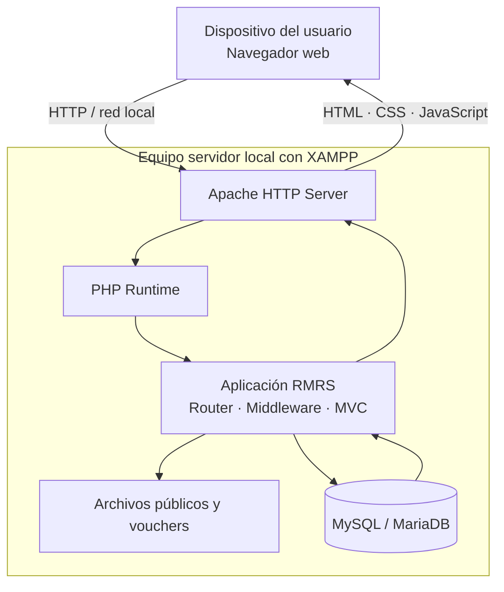

**Fuente:** Elaboración propia.

### Elementos del despliegue

| Elemento | Función |
|---|---|
| Navegador web | Permitir la interacción del usuario con la aplicación. |
| Apache | Recibir y responder solicitudes HTTP. |
| PHP | Ejecutar la lógica del servidor. |
| Aplicación RMRS | Procesar las operaciones del negocio. |
| MySQL/MariaDB | Almacenar la información persistente. |
| Sistema de archivos | Conservar recursos públicos y archivos autorizados. |
| XAMPP | Integrar los servicios requeridos para el entorno local. |

### Consideraciones de configuración

- El archivo de conexión debe mantenerse fuera del control de versiones cuando incluya credenciales.
- Las carpetas que contengan vouchers no deben permitir ejecución de código.
- La base de datos debe configurarse con codificación compatible con los datos del sistema.
- El entorno debe restringir la exposición de errores internos al usuario final.
- Los archivos temporales y respaldos no deben publicarse dentro de la raíz web.
- La configuración debe conservarse mediante variables o archivos locales excluidos del repositorio.

## 4.13 Diseño de escalabilidad y mantenibilidad

La solución actual utiliza una arquitectura monolítica, adecuada para el alcance académico y el volumen estimado del restaurante. No obstante, la separación lógica existente permite plantear una evolución progresiva sin reemplazar completamente el sistema.

### Mantenibilidad

La mantenibilidad se favorece mediante:

- Organización MVC.
- Separación entre controladores, modelos y vistas.
- Acceso centralizado mediante PDO.
- Componentes de sesión y seguridad reutilizables.
- División del sistema en módulos funcionales.
- Convenciones de nombres consistentes.
- Validación centralizada.
- Documentación de módulos, reglas y dependencias.
- Trazabilidad entre requisitos, componentes y pruebas.

### Evolución prevista

Las mejoras futuras pueden incorporar:

- Despliegue en infraestructura web externa.
- Configuración diferenciada para desarrollo y producción.
- Automatización de pruebas.
- Integración continua.
- Servicios automáticos de correo o mensajería.
- Integración con pasarelas de pago.
- Aplicación web progresiva o interfaz SPA.
- Caché para reportes consultados frecuentemente.
- Registro centralizado de eventos y errores.
- Copias de seguridad automatizadas.
- API para integración con aplicaciones externas.
- Separación física entre aplicación y base de datos cuando el volumen lo requiera.

### Figura 4.13. Evolución arquitectónica propuesta

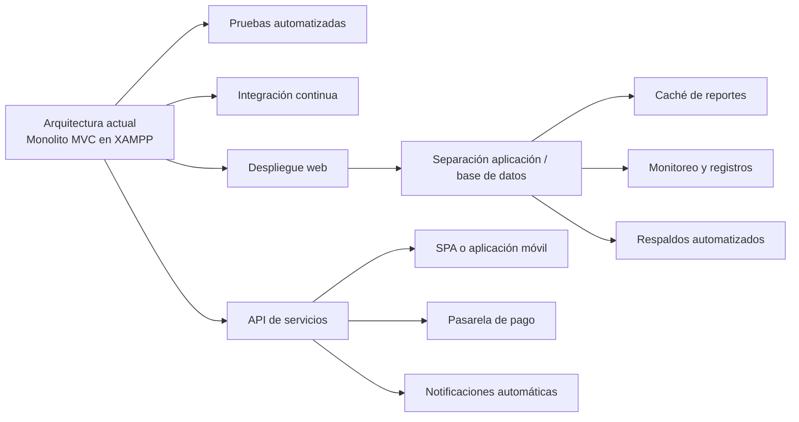

**Fuente:** Elaboración propia.

Estas alternativas se consideran posibilidades de evolución y no funcionalidades implementadas actualmente. Su incorporación dependerá de nuevas necesidades del negocio, disponibilidad presupuestaria, volumen de usuarios y resultados de medición obtenidos durante la operación del sistema.

## Trazabilidad del diseño

La siguiente matriz resume la relación entre las necesidades identificadas y los elementos técnicos que las atienden.

| Necesidad del negocio | Módulo | Componentes principales | Entidades relacionadas |
|---|---|---|---|
| Registrar solicitudes de clientes | Reservas | Router, controlador, modelo, vista y validación | `clientes`, `reservas`, `pagos` |
| Validar adelantos y llegadas | Recepción | Controlador, middleware, modelo y seguridad | `reservas`, `pagos` |
| Controlar disponibilidad | Mesas | Controlador, modelo y vistas operativas | `mesas`, `reservas` |
| Organizar clientes sin mesa | Lista de espera | Controlador, modelo y vista | `clientes`, `lista_espera`, `mesas` |
| Mantener el catálogo | Productos y categorías | Controladores, modelos y validación | `productos`, `categorias` |
| Registrar el consumo | Pedidos | Controlador, modelos y cálculos | `pedidos`, `detalle_pedido`, `productos`, `mesas` |
| Cerrar ventas | Caja y cobros | Controlador, transacción y modelos | `caja`, `cobros`, `pedidos`, `reservas` |
| Controlar accesos | Usuarios y roles | Sesión, middleware y seguridad | `usuarios`, `roles`, `empleados` |
| Apoyar decisiones | Dashboard y reportes | Controlador, modelos de consulta y vistas | Reservas, pedidos, cobros y mesas |

## Conclusión del diseño

El diseño técnico de RMRS mantiene correspondencia con los procesos operativos identificados para D'Barrio Broaster. La arquitectura MVC separa la presentación, la lógica de aplicación y la persistencia; el diseño modular representa las responsabilidades de cada área; y el modelo relacional permite conservar la trazabilidad entre reservas, mesas, pedidos y cobros.

Los mecanismos de sesión, autorización por roles, protección CSRF, consultas parametrizadas y escape de salida conforman la línea base de seguridad. Por su parte, las reglas de integridad y el uso de transacciones contribuyen a mantener la consistencia de las operaciones críticas.

La solución monolítica implementada mediante Apache, PHP y MySQL/MariaDB resulta adecuada para el alcance académico definido. Al mismo tiempo, la separación lógica de sus componentes proporciona una base organizada para incorporar pruebas automatizadas, integración continua, despliegue web, notificaciones, pagos electrónicos y nuevas interfaces en futuras versiones.
